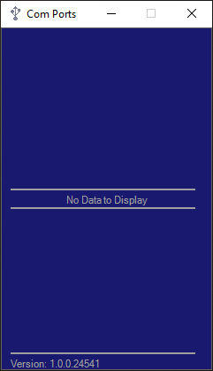
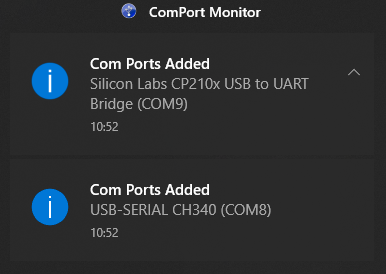
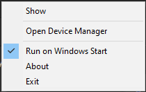

# COM Ports Monitor

A handy windows tray application for monitoring COM ports on Windows.
The application monitors for changes in plugged in devices and reports which COM port was just attached.

## Index

1. [Interface](#intreface)
2. [Installation](#installation)

## Interface

### Window
|                   No devices connected                    |                Connected Devices                |
|:---------------------------------------------------------:|:-----------------------------------------------:|
|  |  |

### Notifications

### Context Menu

- Show -> Displays the Window
- Open Device Manager -> Launches the Windows Device Manager
- Run on Windows Start -> Toggle to start the application when Windows starts.
- About -> Displays the About Window
- Exit -> Well... Self-explanatory but here it goes: Closes the application. 

## Installation

1. Download the latest release from [releases](https://github.com/Tsessebe/ComPorts/releases).
2. Run the installer exe.
3. The Installer is not signed so windows might ask if you want to run the Installer. Select Yes.
4. Follow the prompts.

The app will also start up when windows starts. 
This can be disabled by right-click on the tray icon and deselect "Run on Windows Start" menu.
