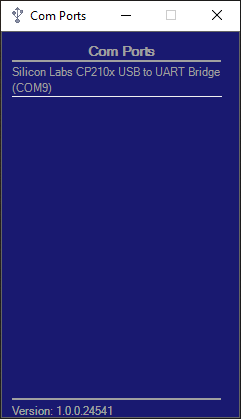

# COM Ports

Windows tray application for monitoring COM ports on Windows.
The application monitors for changes in plugged in devices and reports which COM port was just attached.

## Interface

### Window
No devices connected             | Connected Devices
:-------------------------:|:-------------------------:
 | 

### Notifications

